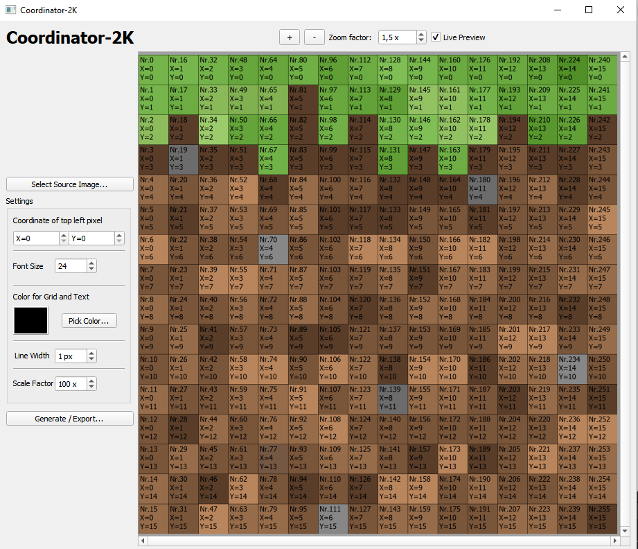

# Coordinator-2K

A gui tool that writes each pixels coordinates into the pixel.

Very useful for planning pixelart on r/place.

Application screenshot:

# Features

✔️Intuitive GUI Application

✔️Zoomable & Scrollable Preview Window

✔️Adjustable x-y-offset

✔️Adjustable font size

✔️Live Preview (optional)

✔️Can work with PNG, JPEG and BMP source files

✔️Written in C++/Qt, cross-platform, better performance than interpreted alternatives (e.g. Python) 

# Current Limitations / Future Features

- Requires *lots* of memory when working with large source images

- Static GUI, widgets dont react to window resize

# Usage

A Pre-compiled version can be downloaded from the releases page.

Run the executable, the application should look similar to the screenshot above.

Click the button "Select Source Image". Chose the image you would like to coordinate.

Note: If you're working with a large image, you may want to disable live preview first.

Note: The source image **must not** be prescaled. Coordinator-2K scales the image x100 so that the text is readable. The source image must have one pixel per pixel.

Now choose the offset (the coordinates of the top left pixel) and a font size. Size 24 works fine for up to 4 digit numbers.

Now click export and chose where to save the output file.

Note: If live preview was disabled, then the output image will only now be generated. This may take a while depending on how much memory you have and how large the source image is. **The app may appear unresponsive, but it doesn't mean it crashed**. The app is single-threaded because multithreading is awful and this project is just for fun.

